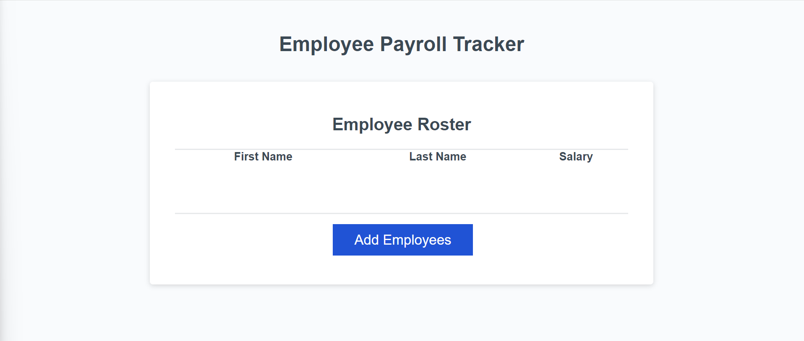

# JavaScript Challenge: Employee Payroll Tracker

## Description

For this Challenge i was given a starter code of a website that tracks employee's pay. The starter code had incomplete javascript, and i had to complete it in order to get the website to properly function. At the beginning the website did nothing when a user tried to click "Add Employees." I was able to:

- 
- 
- 

## Table of Contents

- [Usage](#usage)
- [Credits](#credits)
- [License](#license)

## Usage

<a href="https://github.com/Kadeemking/Module-3-Challenge.git">Git Hub Repo</a>

<a href="https://kadeemking.github.io/Module-3-Challenge/">Live link</a>

## Credits

<a href="https://coding-boot-camp.github.io/full-stack/github/professional-readme-guide">README Format</a> 

<a href="https://gist.github.com/lukas-h/2a5d00690736b4c3a7ba">License for README</a>

## License

